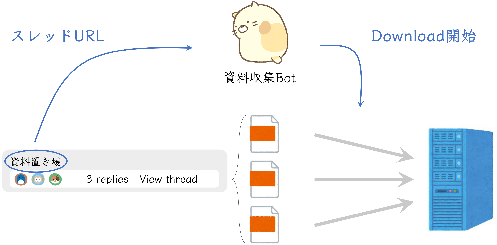
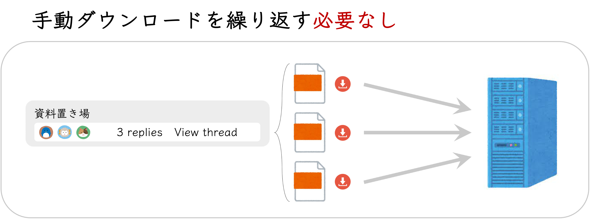

# Slack-File-DL-Personal

# ディレクトリ構造

```
Slack-File-DL-Personal\
|   .gitignore
|   README.md
|   setup.py
|   
+---imgs        # README.md用の画像フォルダ
|       
\---src
    |   __init__.py
    |   Application.py      # GUI用メソッド
    |   Cli.py              # CUI用メソッド
    |   
    \---func
            __init__.py         # 共通メソッド
            config.py           # 共通設定
```

# 資料収集Bot

資料の一括ダウンロードBot

## ✔️ コマンド収集



***



# セットアップ

### 1. ダウンロード

```
$ git clone git@github.com:nagao-lab/Slack-File-DL-Personal.git
$ cd Slack-File-DL-Personal
```

### 2. インストール

ローカルインストールにより、パッケージをインストールしてください。

```
$ pip install -e .
```

### 3. 実行

```
$ slackcat
Usage: slackcat <SUBCOMMAND> [OPTIONS]

SUBCOMMAND(サブコマンド):
    gui                 GUIを起動
    dl                  直近の輪講資料をダウンロード
    all                 ファイルをダウンロード
    list                チャンネル名一覧を表示

$ slackcat all [OPTIONS]
  OPTIONS(オプション):
    -r, --root_path :   ダウンロード先のパス (default: '.')
    -s, --since     :   一括ダウンロードの開始期間 (YYYYMMDD, default: 2021-04-01)
    -u, --until     :   一括ダウンロードの終了期間 (YYYYMMDD, default: now)
    -w, --weeks     :   一括ダウンロードの期間 (--since/--until指定より優先, default: None)
    -c, --channel   :   Slackのチャンネル名
 
$ slackcat list [OPTIONS]
  OPTIONS(オプション):
	-l, --line      :   1行に1件表示 (default: スペース('  ')区切り)

コマンドのヘルプを表示:
$ slackcat <SUBCOMMAND> --help
```